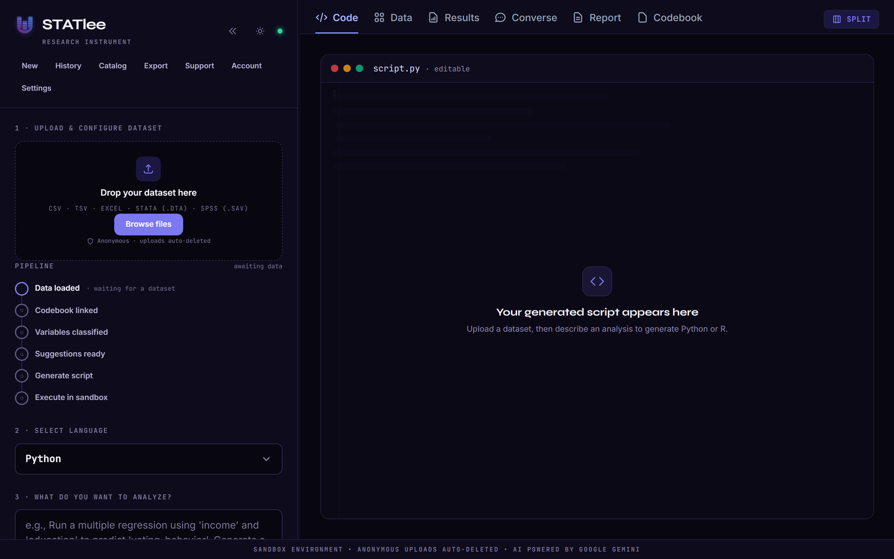

<p align="center">
  
</p>

<h1 align="center">Turn data questions into answers, in plain English.</h1>

<p align="center">
  <b>STATlee</b> is AI data analysis for social scientists. Upload a dataset, describe the
  analysis in plain English, and STATlee writes, moderates, sandboxes, runs, and
  <i>explains</i> the statistics — no Python, no R, no syntax errors.
</p>

<p align="center">
  <a href="docs/ARCHITECTURE.md">Architecture</a> ·
  <a href="docs/SECURITY_AUDIT.md">Security</a> ·
  <a href="docs/DEPLOYMENT_PLAYBOOK.md">Deploy</a> ·
  <a href="docs/PRICING.md">Pricing</a> ·
  <a href="docs/CREDITS.md">Credits</a>
</p>

<p align="center">
  
  
  <a href="https://github.com/yib7/STATlee/actions/workflows/ci.yml"></a>
  
  
</p>

<p align="center">
  
</p>

---

## Why STATlee

Statistical software is hostile to non-coders. SPSS menus, Stata syntax, and R
tibbles all stand between a researcher and a simple question like *"does income
predict turnout?"* STATlee removes that wall: you ask in plain English and get a
runnable analysis, charts, and a plain-English write-up you can defend.

> **Try it:** the marketing landing page lives at **`/welcome`**; the app itself
> is at **`/`**.

## What it does

- **Describe it, don't code it.** Natural-language requests become real
  Python/R that runs and returns results — not just a code snippet.
- **Statistically valid by design.** An *intelligent codebook* classifies each
  variable (nominal / ordinal / continuous) so the model won't run a linear
  model on a categorical outcome. Codebooks can be inferred from a PDF data
  dictionary or even the original survey questionnaire.
- **Secure sandbox.** Generated code runs in a throwaway, **network-less**
  working directory with a **secret-free environment**; `SANDBOX_MODE=docker`
  adds a non-root, read-only, resource-capped container per run. A **run-guard**
  re-moderates any hand-edited script before it executes.
- **Answers you can explain.** Dense terminal output and p-values become
  plain-English Markdown — effect sizes, significance, caveats — and a debugging
  assistant kicks in when a run fails.
- **Bring any format.** CSV, TSV, Excel (`.xlsx`/`.xls`), Stata (`.dta`), and
  SPSS (`.sav`); native value labels seed the codebook for free.
- **Conversational wrangling.** Clean your data by chatting — *"delete the
  notes column", "filter for age > 30"* — with a back-and-forth transcript, full
  version history (**undo / redo**), and a one-click **revert to the original
  upload**. Runs on the cheapest model tier (`WRANGLE_ROLE=lite`) to keep costs
  down. Plus an **AI report builder** grounded strictly in your real outputs and
  one-click **project export** (data + script + plots + report).
- **Priority generation** toggle routes to the fastest, highest-quality model
  tier when a question really matters.

## How it works

```
Upload data ──▶ Intelligent codebook ──▶ Describe analysis (plain English)
     │                                              │
     ▼                                              ▼
 Multi-format            moderation ▶ feature-select ▶ draft ▶ validate
 normalize to CSV                          │
                                           ▼
                          Secure sandbox (subprocess / Docker)
                                           │
                                           ▼
                     Plain-English interpretation + charts ──▶ Report / export
```

Every model call goes through one **role-based LLM service** (`pro` / `flash` /
`lite` / `draft`), so swapping a model — or escalating a request to a stronger
tier for the priority toggle — is a config change, not a code change. Per-request
token usage is surfaced live in the UI.

## Quickstart

```bash
cp .env.example .env          # add your GEMINI_API_KEY
docker-compose up --build     # then open http://localhost:5000
```

Or run locally without Docker (dev only — generated code runs on your host):

```bash
python -m venv venv && source venv/bin/activate   # Windows: venv\Scripts\activate
pip install -r requirements.txt
APP_ENV=development python wsgi.py                 # http://localhost:5000
```

### LLM configuration

STATlee uses **Google Gemini**. Set `GEMINI_API_KEY` (get one at
[Google AI Studio](https://aistudio.google.com/apikey)); it's required in
production. Model ids per role can be pinned with `MODEL_PRO` / `MODEL_FLASH` /
`MODEL_FLASH_LITE` but default to current Gemini models. The full feature set —
including the multimodal paths (PDF codebook extraction, plot interpretation) —
runs on Gemini.

See [docs/README.md](docs/README.md) for the full setup, Docker sandbox build,
and the documented [`.env.example`](.env.example).

## Development

```bash
pip install -r requirements-dev.txt
ruff check .      # lint
pytest -q         # 154 tests, fully offline (deterministic fake LLM — no API key)
```

The test suite injects a fake LLM service, so the entire HTTP surface (uploads,
codebook, wrangling, run-guard, converse, export, auth, CSRF, rate-limit keying,
billing seam, priority routing) is exercised without network or API keys. CI runs
ruff + byte-compile + pytest on every push (`.github/workflows/ci.yml`).

## Architecture at a glance

The application lives in the `statlee/` package (entry point: `wsgi.py` →
`statlee.app:app`).

| Module | Responsibility |
|---|---|
| `statlee/config.py` | Validated, env-driven configuration (one source of truth). |
| `statlee/app.py` | App factory + middleware (sessions, CSRF, rate limits, ProxyFix, request-id logging). |
| `statlee/storage.py` | Per-identity file isolation + dataset version control. |
| `statlee/sandbox.py` | Isolated code execution (subprocess or Docker). |
| `statlee/llm.py` | Role-based Gemini service: usage tracking, priority escalation, response cache. |
| `statlee/billing.py` | Monetization seam — `check_and_debit` chokepoint (no-op today). |
| `statlee/prompts.py` | Every prompt builder in one reviewable place. |
| `statlee/datatools.py` | Multi-format ingestion + metadata profiling. |
| `statlee/models.py` | SQLAlchemy models (users, datasets, runs, issue reports). |
| `statlee/routes/` | Blueprints: `auth`, `datasets`, `analyze`, `converse`, `misc`. |

A deeper walkthrough — request lifecycle, security boundaries, data flow — is in
[docs/ARCHITECTURE.md](docs/ARCHITECTURE.md).

## Hosting & pricing

STATlee runs locally for free and is **not currently deployed** — a deliberate,
zero-cost choice. When you want it online, the
[Deployment Playbook](docs/DEPLOYMENT_PLAYBOOK.md) walks through a **money-safe**
free-tier deploy: the app's only real cost is the Gemini API, and it ships with
the controls to cap that spend at a number you choose (a global monthly priority
ceiling, per-identity rate limits, cheapest-tier defaults, and a startup warning
if billing is on without a cap). The (illustrative) monetization model and how
the billing seam backs it are in [Pricing](docs/PRICING.md).

## Security

The execution **sandbox** is the real security boundary: secret-free env,
throwaway dir, optional network-less container, plus a run-guard that
re-moderates edited scripts. Rate limits are keyed per-identity (client IP /
account, not a resettable cookie) to protect against bill abuse. The full
adversarial review is in [docs/SECURITY_AUDIT.md](docs/SECURITY_AUDIT.md).

## Compliance & attribution

STATlee's AI analysis is powered by **[Google Gemini](https://ai.google.dev/)**
via the Google GenAI SDK, as attributed in the in-app footer. Use is subject to
the [Gemini API Additional Terms](https://ai.google.dev/gemini-api/terms) and the
[Prohibited Use Policy](https://ai.google.dev/gemini-api/terms#use-policy), which
STATlee's moderation gate enforces.

Third-party libraries and their licenses are listed in [CREDITS.md](docs/CREDITS.md).

STATlee is a research aid: **always review generated code and results before
relying on them.**

## License

STATlee is released under the [MIT License](LICENSE). See
[CREDITS.md](docs/CREDITS.md) for third-party dependency licenses.
